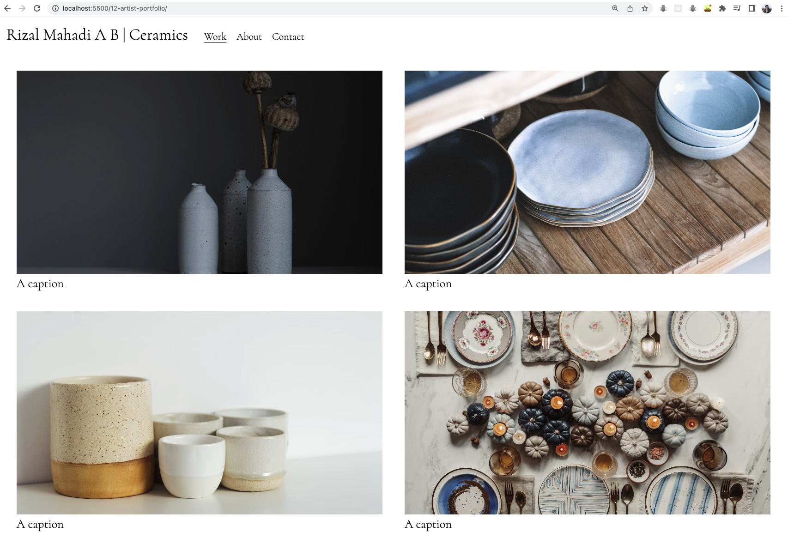
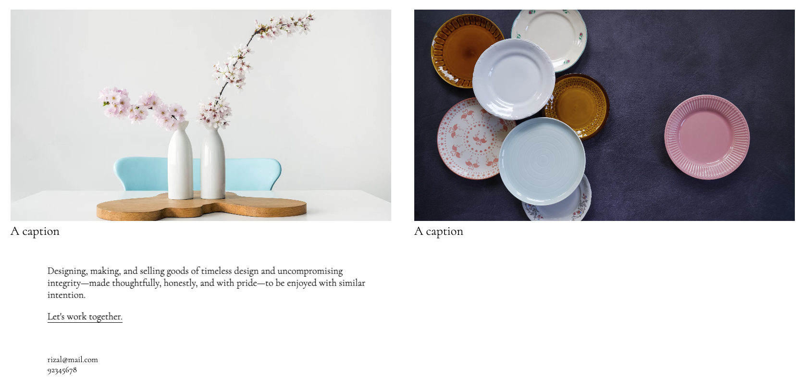
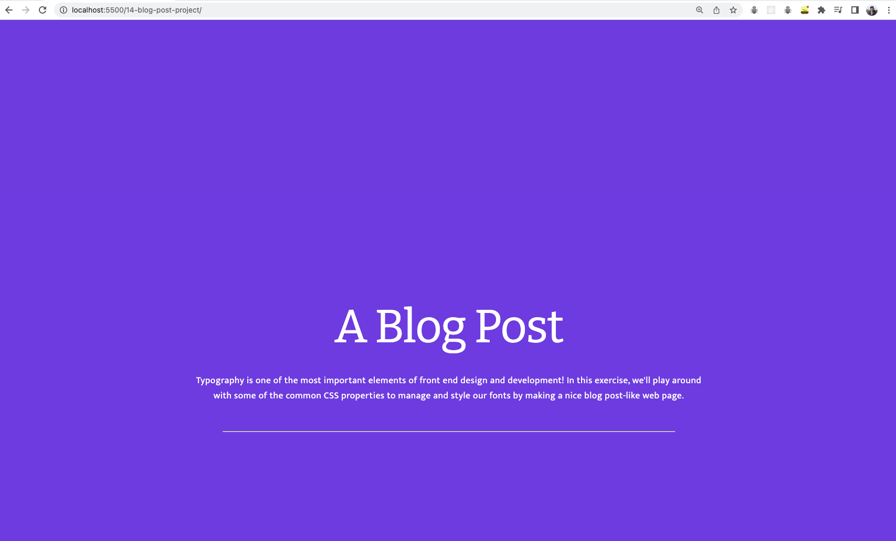
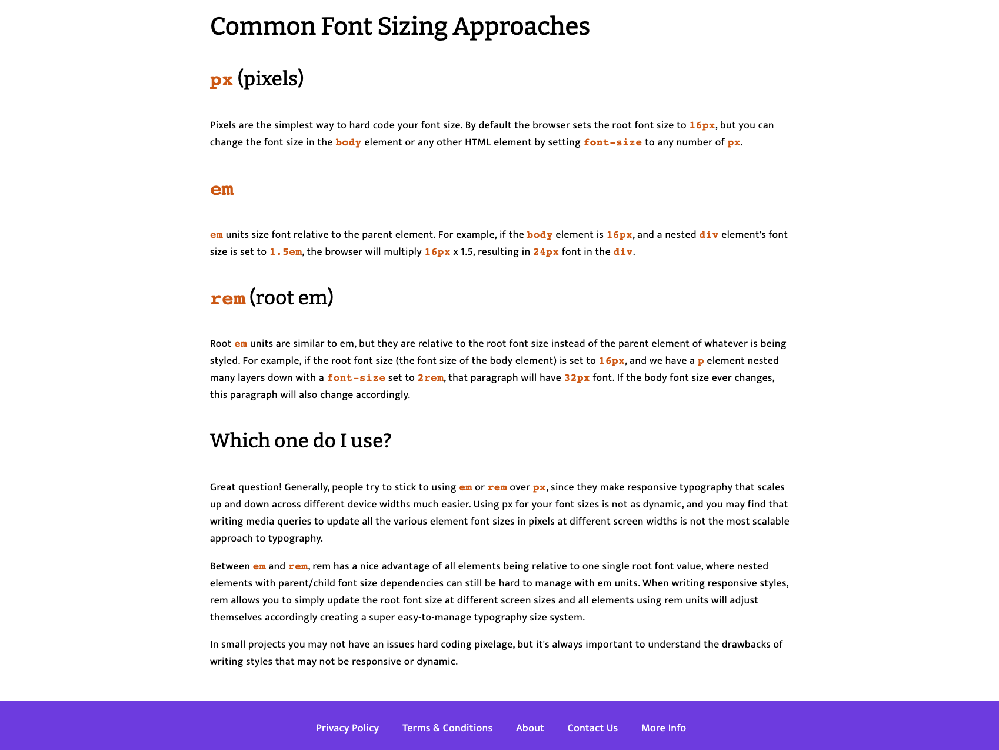
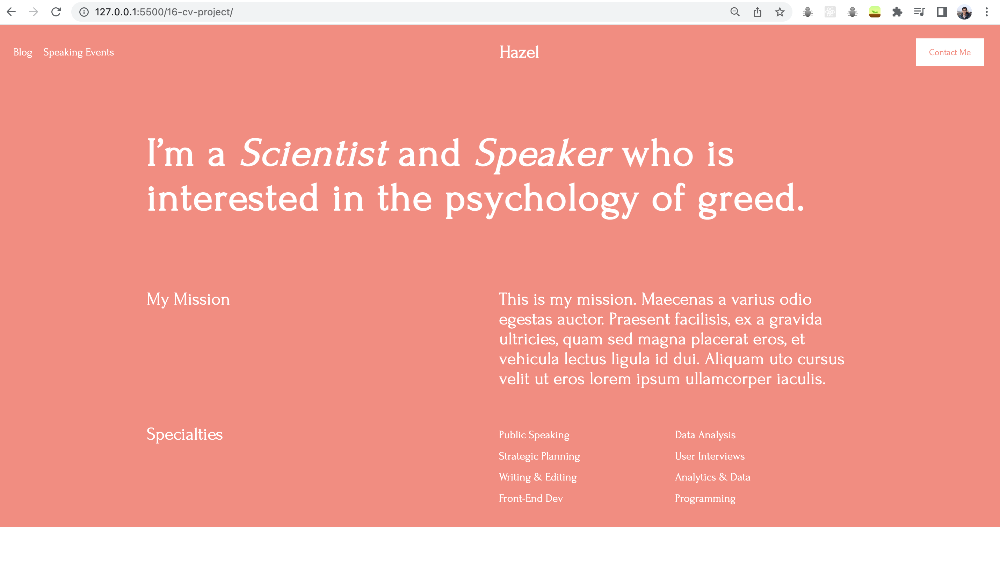
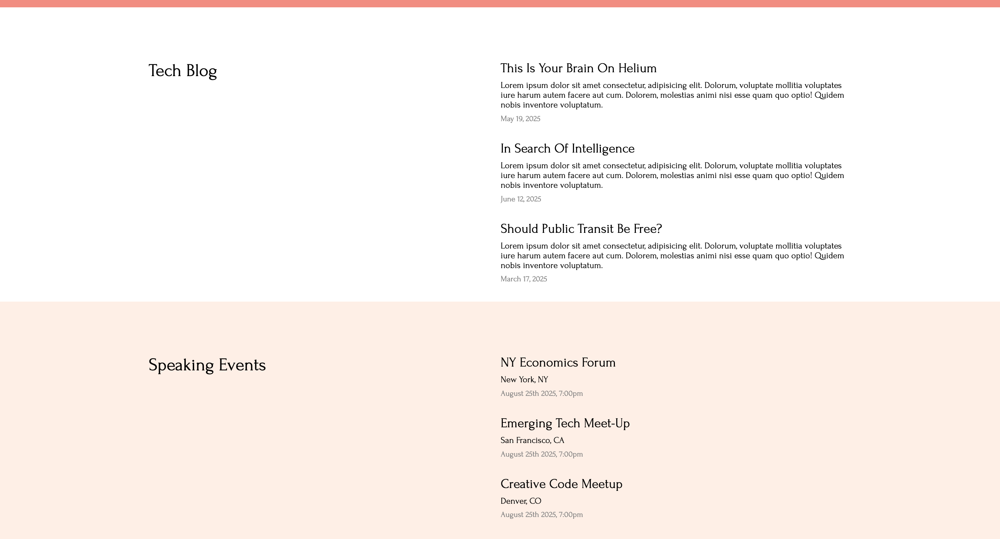
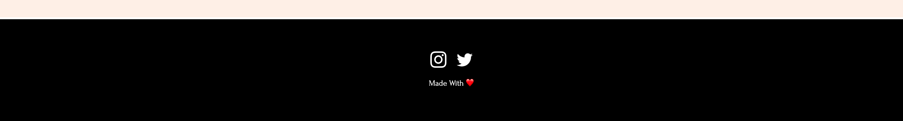

# Projects covered

## 12-artist-portfolio

Concepts covered:

- Layout (with margins, padding)
- Typography

## 14-blog-post-project

## 16-cv-project

Concepts covered:

- Flexbox (minimal amount as it was just introduced)
- Layouts (with _float_. Eg. `float: right`)
- Rems (for font-size)

